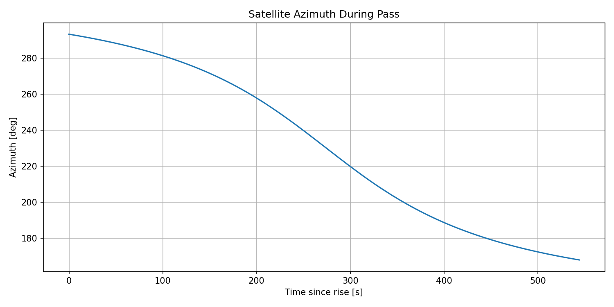
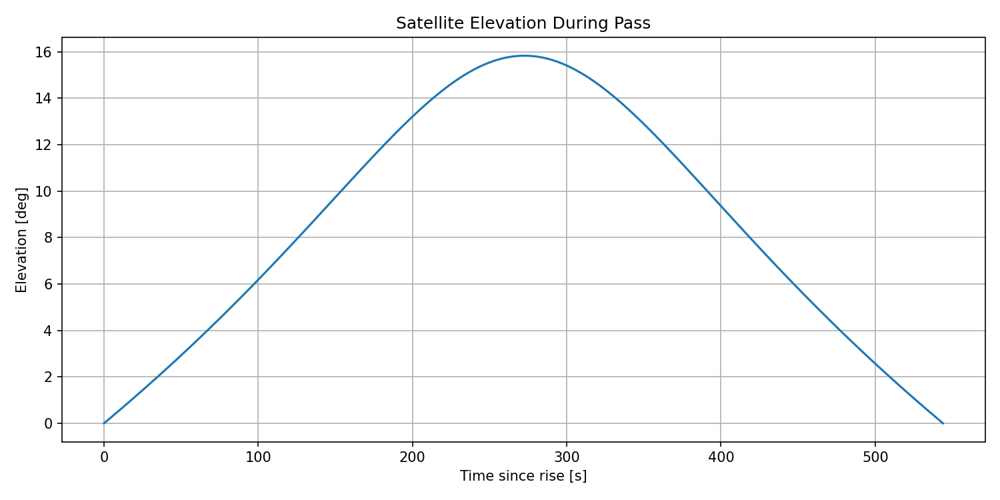
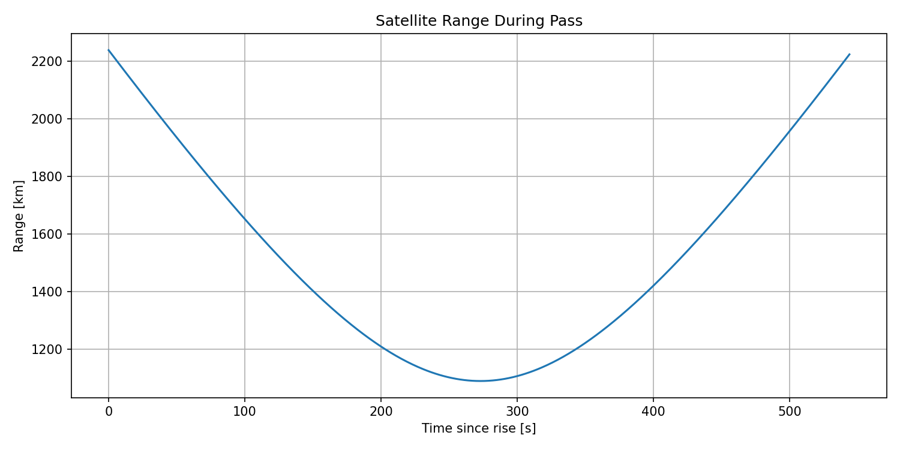
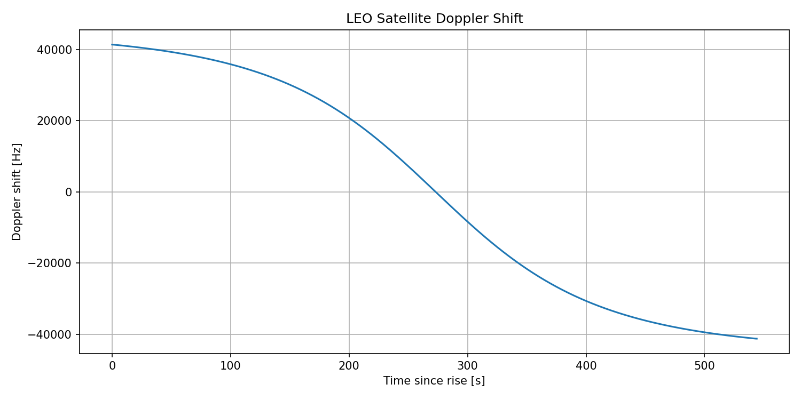

# LEO Geometry and Doppler

## Objective

Implement the first stage of the LEO satellite-to-ground
channel modeling pipeline:

TLE → SGP4 → satellite state → ground geometry → Doppler

The goal is to verify that the orbital geometry and Doppler
behavior are physically reasonable before moving to ray tracing.

---

## Input

### Satellite

Satellite:
STARLINK-1008

Orbital propagation:
SGP4 using the provided TLE.

### Ground station

Latitude:
40.7128°

Longitude:
-74.0060°

Height:
10 m

### Carrier

Carrier frequency:

fc = 2 GHz

---

## Pass

Selected pass:

Rise:
2026-09-02 20:06:12

Culmination:
2026-09-02 20:10:45

Set:
2026-09-02 20:15:16

Pass duration:

544 s

Sampling interval:

1 s

Number of samples:

545

---

## Geometry

For every sample, the satellite geometry is calculated
from the ground station.

The main quantities are:

- elevation angle
- azimuth angle
- slant range

The slant range is

R(t) = ||r_sat(t) - r_ground(t)||

where R is the satellite-to-ground distance.

For this pass:

Maximum elevation:

15.830°

Minimum range:

1089.905 km

---

## Radial velocity

Doppler depends on the component of relative velocity
along the line of sight, rather than the satellite's
total orbital velocity.

The radial velocity is obtained from the rate of change
of slant range:

v_r(t) = dR(t)/dt

A numerical gradient is used with a 1-second sampling
interval.

For this pass:

Maximum radial velocity:

6.186 km/s

Minimum radial velocity:

-6.209 km/s

---

## Doppler

The Doppler shift is calculated as:

f_D(t) = -(v_r(t) / c) f_c

where:

c = 299792.458 km/s

and:

f_c = 2 GHz.

Observed results:

Maximum Doppler:

41.420 kHz

Minimum Doppler:

-41.267 kHz

Maximum absolute Doppler:

41.420 kHz

---

## Validation

The simulation passes the following sanity checks:

1. The satellite rises above the horizon and later sets.
2. Elevation increases and then decreases during the pass.
3. Slant range reaches a minimum during the pass.
4. Radial velocity changes sign as the satellite changes
   from approaching to receding.
5. Doppler changes sign accordingly.
6. The maximum Doppler is on the order of tens of kHz.
7. The observed maximum Doppler (~41.4 kHz) is close to
   the ~43.7 kHz scale reported in the reference paper.

The difference from the paper is expected because the
simulation does not necessarily use the same satellite
trajectory, ground station, TLE epoch, or observation
geometry.

---

## Outputs

The CSV contains one row per 1-second sample with:

time,
elevation,
azimuth,
range,
radial velocity,
Doppler shift.

---
